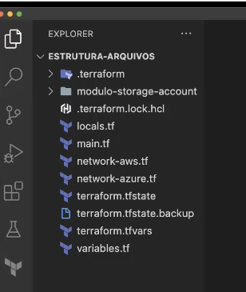
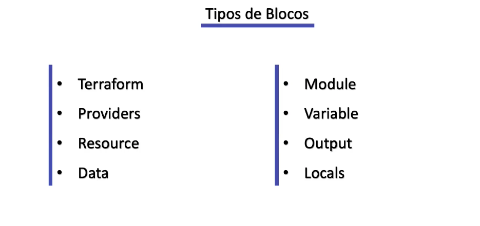
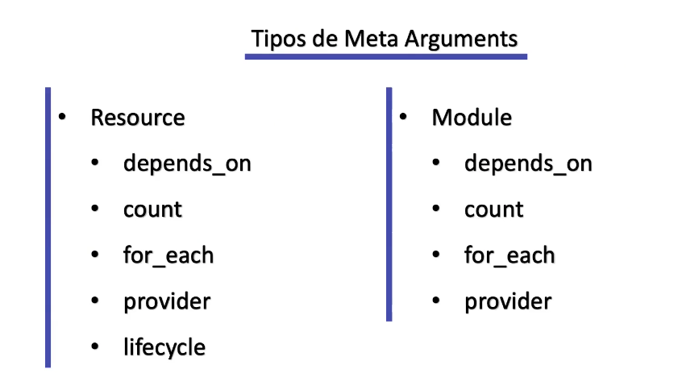

## Link repositório do curso: [https://gitlab.com/terraform-basico-ao-avancado](https://gitlab.com/terraform-basico-ao-avancado)

## Utilizando terraform via docker:

### Iniciar um container:

docker container run -it --name terraform -v $(pwd):/mnt/curso-terraform --entrypoint /bin/sh hashicorp/terraform


### Remover o container que foi criado anteriormente:

docker container stop terraform && docker container rm terraform


### Iniciar um container configurando para que seja automaticamente removido quando sair dele:

docker container run -it --rm --name terraform -v $(pwd):/mnt/curso-terraform --entrypoint /bin/sh hashicorp/terraform


## Documentações:

###
**Terraform:** [https://developer.hashicorp.com/terraform/language](https://developer.hashicorp.com/terraform/language)

**Terraform console:** [https://developer.hashicorp.com/terraform/cli/commands/console](https://developer.hashicorp.com/terraform/cli/commands/console)

**Providers:** [https://registry.terraform.io/browse/providers](https://registry.terraform.io/browse/providers)

**Módulos:** [https://registry.terraform.io/browse/modules](https://registry.terraform.io/browse/modules)

**Terraform CLI:** [https://developer.hashicorp.com/terraform/cli](https://developer.hashicorp.com/terraform/cli)

**Configuration Language Local State:** [https://developer.hashicorp.com/terraform/language/state](https://developer.hashicorp.com/terraform/language/state)

**Configuration Language Backend:** [https://developer.hashicorp.com/terraform/language/settings/backends/configuration](https://developer.hashicorp.com/terraform/language/settings/backends/configuration)

**Configuration Language Variables:** [https://developer.hashicorp.com/terraform/language/values/variables](https://developer.hashicorp.com/terraform/language/values/variables)

**Configuration Language Output:** [https://developer.hashicorp.com/terraform/cli/commands/output](https://developer.hashicorp.com/terraform/cli/commands/output)

**Terraform Language Modules:** [https://developer.hashicorp.com/terraform/language/modules](https://developer.hashicorp.com/terraform/language/modules)

**Terraform Provisioner**: [https://developer.hashicorp.com/terraform/language/resources/provisioners/syntax](https://developer.hashicorp.com/terraform/language/resources/provisioners/syntax)

## Estrutura de arquivos base do terraform


## Tipos de blocos do terraform


## Tipos de meta arguments


## Comandos Terraform

`terraform console`: Prove um console interativo do terraform para avaliar expressões e afins

`terraform providers`:  Lista provedores configurados

`terraform init`: Inicia modulos dos terraform

`terraform init -upgrade`: Instale as versões mais recentes do módulo e do provedor permitidas dentro das restrições configuradas, substituindo o comportamento padrão de selecionar exatamente a versão registrada no arquivo de bloqueio de dependência.

`terraform init -reconfigure`: Cria uma nova configuração a partir das novas definições do `backend` alterado, gerando um novo `terraform-state`

`terraform init -migrate-state`: Cria uma nova configuração do partir das novas definições do `backend`, migrando o `terraform-state` atual para as novas configurações do `backend` reconfigurado

`terraform init -backend-config={BACKEND_FILE}`: Inicia as provedores do `terraform` configurando o `backend` nos providers dinâmicamente apartir de um arquivo especificado em `-backend-config={BACKEND_FILE}`

`terraform init -force-copy`: Realizar todo o procediment do `terraform init -migrate-state` sem solicitar uma aprovação manual

`terraform fmt`: Formata código terraform

`terraform fmt -recursive`: Formata código terraform recursivamente da raiz e todas as subpastas do projeto

`terraform fmt -check`: Verifica quais arquivos serão formatados

`terraform fmt -diff`: Exibi quais arquivos foram alterados e formata

`terraform validate`: Verifica se o terraform é valido OBS: Só funciona após executado o `terraform init`

`terraform plan`: Exibi todas alterações que serão realizadas pelo terraform

`terraform plan -out plan.out`: Exibi todas alterações que serão realizadas e cria arquivo de plano de execução

`terraform plan -out plan.out -destroy`: Exibi todas alterações que serão realizadas pelo terraform e cria arquivo de execução para destruição do plano

`terraform plan -target={RESOURCE}`: Limitar a operação de planeamento apenas ao módulo indicado, recurso ou instância de recurso e todas as suas dependências. É possível utilizar esta opção várias vezes para incluir mais de um objeto. Esta opção é para uso uso excecional.

`terraform plan -replace={RESOURCE}`: Força a substituição de uma determinada instância de recurso utilizando seu endereço de recurso. Se o plano teria normalmente
produzido uma ação de atualização ou no-op para esta instância, Terraform planeará substituí-la em vez disso. É possível usar esta opção várias vezes para substituir mais de um objeto.

`terraform show`: Exibi o terraform.tfstate

`terraform show -out plan.out`: Exibi arquivo gerado pelo `terraform plan -out plan.out`

`terraform apply`: Aplica o plano configurado

`terraform apply -auto-approve`: Aplica o plano configurado sem solicitar confirmaçao manual

`terraform apply plan.out`: Aplica o plano configurado utilizando arquivo binário

`terraform apply -target={RESOURCE}`: Limitar a operação de planeamento apenas ao módulo indicado, recurso ou instância de recurso e todas as suas dependências. É possível utilizar esta opção várias vezes para incluir mais de um objeto. Esta opção é para uso uso excecional.

`terraform apply -replace={RESOURCE}`: Força a substituição de uma determinada instância de recurso utilizando seu endereço de recurso. Se o plano teria normalmente
produzido uma ação de atualização ou no-op para esta instância, Terraform planeará substituí-la em vez disso. É possível usar esta opção várias vezes para substituir mais de um objeto.

`terrafor destroy`: Cria e aplica plano para excluir terraform aplicado

`terraform state`: Lista os recursos do comando `state`

`terraform state list`: Lista os recursos criados

`terraform state show {RESOURCE}`: Lista as informações exclusivamente do resurso informado

`terraform state mv {RESOURCE}.{RESOURCE_NAME} {RESOURCE}.{NEW_RESOURCE_NAME}`: Reconfigurado um recurso dentro do terraform

`terraform state rm {RESOURCE}`: Exclui um recurso do `terraform-state`, ou seja se eu excluir do meu código terraform um determinado e por algum motivo quero deixar ese recurso persisitdo na cloud.

`terraform state pull`: Exibir o `terraform-state` que está configurado no `backend`

`terraform state pull -> state.tfst`: Baixa o arquivo configurado do `terraform-state` que está configurado no `backend`

`terraform state push {FILE_NAME}`: Realiza o pull do arquivo de `terraform-state` local para o `state` remoto configurado no `backend`

`terraform state push -force {FILE_NAME}`: Realiza o pull forçado do arquivo de `terraform-state` local para o `state` remoto configurado no `backend` (Pode ser necessário quando a divergência do `serial` `version` local com o remoto)

`terraform state replace-provider {CURRENT_PROVIDER} {NEW_PROVIDER}`: Realiza o replace do `provider` atual para um novo `provider`

`terraform import`: Lista comandos `import` referentes ao processo de importar um recurso já existente na cloud para o `terraform-state` de forma que o recurso possa começar a ser gerenciado pelo `terraform` (OBS: Para fazer esse processo o primeiro passo é criar o arquivo do curso no código terraform)

`terraform import {RESOURCE}`: Importa um recurso da **aws** para ser gerenciado pelo `terraform`

`terraform refresh`: Atualiza o `terraform-state` com as informações dos recursos na cloud

`terraform force-unlock`: Força o `unlock` do `terraform-state`

`terraform get`: Realiza donwload de módulos remotos sem precisar fazer o `terraform init` ou em casos no qual o terraform já foi inicializado e é necessário atualizar algum módulo

`terraform workspace`: Lista comandos do do `workspace`


## Funções Terraform

####  File: [https://developer.hashicorp.com/terraform/language/functions/file](https://developer.hashicorp.com/terraform/language/functions/file)

## Dicas

### Dica rápida para conferir o “shape” de um estado:

> `terraform state show {{MODULE}}`

**OU de forma interativa**
```bash
terraform console
ec_deployment.ess
```

# AWS CLI COMANDOS

## 🧹 Remover as configurações atuais

O aws configure list mostra de onde vêm as credenciais (env vars, arquivo ~/.aws/credentials, etc.).

Para remover as configs atuais:

1. Remover do ambiente (variáveis de sessão):
    ```bash
    unset AWS_ACCESS_KEY_ID
    unset AWS_SECRET_ACCESS_KEY
    unset AWS_SESSION_TOKEN
    unset AWS_PROFILE
    ```

   No PowerShell (Windows):

    ```powershell
    Remove-Item Env:AWS_ACCESS_KEY_ID
    Remove-Item Env:AWS_SECRET_ACCESS_KEY
    Remove-Item Env:AWS_SESSION_TOKEN
    Remove-Item Env:AWS_PROFILE
    ```


2. Remover dos arquivos de configuração:
   * Credenciais ficam em ~/.aws/credentials
   * Configurações de perfil ficam em ~/.aws/config
    <br><br>
   Você pode apagar manualmente:

    ```bash
    rm -f ~/.aws/credentials
    rm -f ~/.aws/config
    ```


⚠️ **Cuidado: Isso apaga todos os perfis.
Se quiser apagar só um perfil, edite o arquivo e remova a seção [profile-nome].**

## 🔑 Fazer login na AWS CLI

Existem 3 jeitos comuns:

1. Chaves estáticas (IAM User) <br>
    O jeito mais simples, mas menos seguro (ideal apenas para testes).
    Rode:
    ```bash
    aws configure
    ```
   
   Ele vai perguntar:
   ```bash
   AWS Access Key ID [None]: AKIAEXEMPLO123
   AWS Secret Access Key [None]: abc123...
   Default region name [None]: sa-east-1
   Default output format [None]: json
   ```
   
   Isso cria ~/.aws/credentials com as chaves e a região.

    ```bash
    AWS Access Key ID [None]: AKIAEXEMPLO123
    AWS Secret Access Key [None]: abc123...
    Default region name [None]: sa-east-1
    Default output format [None]: json
    ```

2. Perfil nomeado

    Melhor para vários ambientes (dev, prod):

    aws configure --profile meu-perfil

    Depois use:

    `export AWS_PROFILE=meu-perfil`   # Linux/Mac
    
    `setx AWS_PROFILE meu-perfil`    # Windows (persistente)

    E rode normalmente aws ... que ele usará esse perfil.

## 🧪 Teste final

Depois de configurar, rode:

```bash
aws sts get-caller-identity
```

Você deve ver um JSON com Account e Arn confirmando que está autenticado.

## 🔧 1. Definir no ~/.bashrc ou ~/.bash_profile
O Git Bash carrega um arquivo de inicialização sempre que você abre.<br>
Você pode adicionar a variável lá:

```bash
echo 'export AWS_PROFILE=meu-perfil' >> ~/.bashrc
```

E para garantir que é carregado:
```bash
source ~/.bashrc
```

## 🧠 Diferença entre .bashrc e .bash_profile

.bashrc → carregado em cada shell interativo (ideal para variáveis de ambiente).

.bash_profile → carregado só no login.

No Git Bash, normalmente .bashrc já é chamado, então é o lugar certo.

### 🔎 Para conferir

Feche e reabra o Git Bash e rode:

```bash
echo $AWS_PROFILE
```


Saída esperada:

```bash
meu-perfil
```

E para validar de verdade:

```bash
aws sts get-caller-identity
```

Vai mostrar a conta/ARN do perfil que você definiu.

### ⚠️ Observação

**Se você usa vários perfis (ex.: dev, prod), pode colocar um alias no ~/.bashrc para trocar fácil:**

```bash
alias use-dev='export AWS_PROFILE=dev'
alias use-prod='export AWS_PROFILE=prod'
```

Aí você só digita use-dev ou use-prod no terminal para trocar.