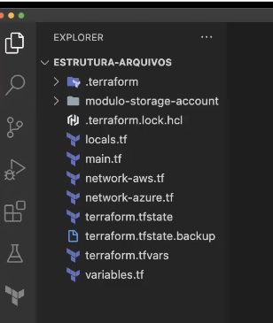

## Link repositório do curso: [https://gitlab.com/terraform-basico-ao-avancado](https://gitlab.com/terraform-basico-ao-avancado)

## Utilizando terraform via docker:

### Iniciar um container:

docker container run -it --name terraform -v $(pwd):/mnt/curso-terraform --entrypoint /bin/sh hashicorp/terraform

### Remover o container que foi criado anteriormente:

docker container stop terraform && docker container rm terraform

### Iniciar um container configurando para que seja automaticamente removido quando sair dele:

docker container run -it --rm --name terraform -v $(pwd):/mnt/curso-terraform --entrypoint /bin/sh hashicorp/terraform

## Documentações:

###
**Terraform:** [https://developer.hashicorp.com/terraform/language](https://developer.hashicorp.com/terraform/language)

**Providers:** [https://registry.terraform.io/browse/providers](https://registry.terraform.io/browse/providers)

**Módulos:** [https://registry.terraform.io/browse/modules](https://registry.terraform.io/browse/modules)

**Terraform CLI:** [https://developer.hashicorp.com/terraform/cli](https://developer.hashicorp.com/terraform/cli)

**Configuration Language Local State:** [https://developer.hashicorp.com/terraform/language/state](https://developer.hashicorp.com/terraform/language/state)

**Configuration Language Backend:** [https://developer.hashicorp.com/terraform/language/settings/backends/configuration](https://developer.hashicorp.com/terraform/language/settings/backends/configuration)

**Configuration Language Variables:** [https://developer.hashicorp.com/terraform/language/values/variables](https://developer.hashicorp.com/terraform/language/values/variables)

**Configuration Language Output:** [https://developer.hashicorp.com/terraform/cli/commands/output](https://developer.hashicorp.com/terraform/cli/commands/output)

## Estrutura de arquivos base do terraform

## Tipos de blocos do terraform

## Comandos Terraform

`terraform providers`:  Lista provedores configurados

`terraform init`: Inicia modulos dos terraform

`terraform fmt`: Formata código terraform

`terraform fmt -check`: Verifica quais arquivos serão formatados

`terraform fmt -diff`: Exibi quais arquivos foram alterados e formata

`terraform validate`: Verifica se o terraform é valido OBS: Só funciona após executado o `terraform init`

`terraform plan`: Exibi todas alterações que serão realizadas pelo terraform

`terraform plan -out plan.out`: Exibi todas alterações que serão realizadas e cria arquivo de plano de execução

`terraform plan -out plan.out -destroy`: Exibi todas alterações que serão realizadas pelo terraform e cria arquivo de execução para destruição do plano

`terraform show`: Exibi arquivo gerado pelo `terraform plan -out plan.out`

`terraform apply`: Aplica o plano configurado

`terraform apply plan.out`: Aplica o plano configurado utilizando arquivo binário

`terrafor destory`: Cria e aplica plano para excluir terraform aplicado