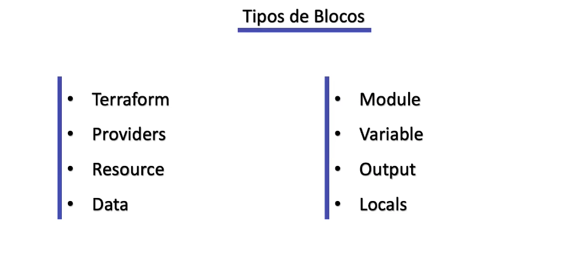

## Link repositório do curso: [https://gitlab.com/terraform-basico-ao-avancado](https://gitlab.com/terraform-basico-ao-avancado)

## Utilizando terraform via docker:

### Iniciar um container:

docker container run -it --name terraform -v $(pwd):/mnt/curso-terraform --entrypoint /bin/sh hashicorp/terraform

### Remover o container que foi criado anteriormente:

docker container stop terraform && docker container rm terraform

### Iniciar um container configurando para que seja automaticamente removido quando sair dele:

docker container run -it --rm --name terraform -v $(pwd):/mnt/curso-terraform --entrypoint /bin/sh hashicorp/terraform

## Documentações:

###
**Terraform:** [https://developer.hashicorp.com/terraform/language](https://developer.hashicorp.com/terraform/language)

**Providers:** [https://registry.terraform.io/browse/providers](https://registry.terraform.io/browse/providers)

**Módulos:** [https://registry.terraform.io/browse/modules](https://registry.terraform.io/browse/modules)

**Terraform CLI:** [https://developer.hashicorp.com/terraform/cli](https://developer.hashicorp.com/terraform/cli)

**Configuration Language Local State:** [https://developer.hashicorp.com/terraform/language/state](https://developer.hashicorp.com/terraform/language/state)

**Configuration Language Backend:** [https://developer.hashicorp.com/terraform/language/settings/backends/configuration](https://developer.hashicorp.com/terraform/language/settings/backends/configuration)

**Configuration Language Variables:** [https://developer.hashicorp.com/terraform/language/values/variables](https://developer.hashicorp.com/terraform/language/values/variables)

**Configuration Language Output:** [https://developer.hashicorp.com/terraform/cli/commands/output](https://developer.hashicorp.com/terraform/cli/commands/output)

**Terraform Language Modules:** [https://developer.hashicorp.com/terraform/language/modules](https://developer.hashicorp.com/terraform/language/modules)

**Terraform Provisioner**: [https://developer.hashicorp.com/terraform/language/resources/provisioners/syntax](https://developer.hashicorp.com/terraform/language/resources/provisioners/syntax)

## Estrutura de arquivos base do terraform

## Tipos de blocos do terraform

## Comandos Terraform

`terraform providers`:  Lista provedores configurados

`terraform init`: Inicia modulos dos terraform

`terraform init -reconfigure`: Cria uma nova configuração a partir das novas definições do `backend` alterado, gerando um novo `terraform-state`

`terraform init -migrate-state`: Cria uma nova configuração do partir das novas definições do `backend`, migrando o `terraform-state` atual para as novas configurações do `backend` reconfigurado

`terraform init -backend-config={BACKEND_FILE}`: Inicia as provedores do `terraform` configurando o `backend` nos providers dinâmicamente apartir de um arquivo especificado em `-backend-config={BACKEND_FILE}`

`terraform init -force-copy`: Realizar todo o procediment do `terraform init -migrate-state` sem solicitar uma aprovação manual

`terraform fmt`: Formata código terraform

`terraform fmt -recursive`: Formata código terraform recursivamente da raiz e todas as subpastas do projeto

`terraform fmt -check`: Verifica quais arquivos serão formatados

`terraform fmt -diff`: Exibi quais arquivos foram alterados e formata

`terraform validate`: Verifica se o terraform é valido OBS: Só funciona após executado o `terraform init`

`terraform plan`: Exibi todas alterações que serão realizadas pelo terraform

`terraform plan -out plan.out`: Exibi todas alterações que serão realizadas e cria arquivo de plano de execução

`terraform plan -out plan.out -destroy`: Exibi todas alterações que serão realizadas pelo terraform e cria arquivo de execução para destruição do plano

`terraform show`: Exibi o terraform.tfstate

`terraform show -out plan.out`: Exibi arquivo gerado pelo `terraform plan -out plan.out`

`terraform apply`: Aplica o plano configurado

`terraform apply -auto-approve`: Aplica o plano configurado sem solicitar confirmaçao manual

`terraform apply plan.out`: Aplica o plano configurado utilizando arquivo binário

`terrafor destory`: Cria e aplica plano para excluir terraform aplicado

`terraform state`: Lista os recursos do comando `state`

`terraform state list`: Lista os recursos criados

`terraform state show {RESOURCE}`: Lista as informações exclusivamente do resurso informado

`terraform state mv {RESOURCE}.{RESOURCE_NAME} {RESOURCE}.{NEW_RESOURCE_NAME}`: Reconfigurado um recurso dentro do terraform

`terraform state rm {RESOURCE}`: Exclui um recurso do `terraform-state`, ou seja se eu excluir do meu código terraform um determinado e por algum motivo quero deixar ese recurso persisitdo na cloud.

`terraform state pull`: Exibir o `terraform-state` que está configurado no `backend`

`terraform state pull -> state.tfst`: Baixa o arquivo configurado do `terraform-state` que está configurado no `backend`

`terraform state push {FILE_NAME}`: Realiza o pull do arquivo de `terraform-state` local para o `state` remoto configurado no `backend`

`terraform state push -force {FILE_NAME}`: Realiza o pull forçado do arquivo de `terraform-state` local para o `state` remoto configurado no `backend` (Pode ser necessário quando a divergência do `serial` `version` local com o remoto)

`terraform state replace-provider {CURRENT_PROVIDER} {NEW_PROVIDER}`: Realiza o replace do `provider` atual para um novo `provider`

`terraform import`: Lista comandos `import` referentes ao processo de importar um recurso já existente na cloud para o `terraform-state` de forma que o recurso possa começar a ser gerenciado pelo `terraform` (OBS: Para fazer esse processo o primeiro passo é criar o arquivo do curso no código terraform)

`terraform import {RESOURCE}`: Importa um recurso da **aws** para ser gerenciado pelo `terraform`

`terraform refresh`: Atualiza o `terraform-state` com as informações dos recursos na cloud

`terraform force-unlock`: Força o `unlock` do `terraform-state`

`terraform get`: Realiza donwload de módulos remotos sem precisar fazer o `terraform init` ou em casos no qual o terraform já foi inicializado e é necessário atualizar algum módulo

## Funções Terraform

####  File: [https://developer.hashicorp.com/terraform/language/functions/file](https://developer.hashicorp.com/terraform/language/functions/file)