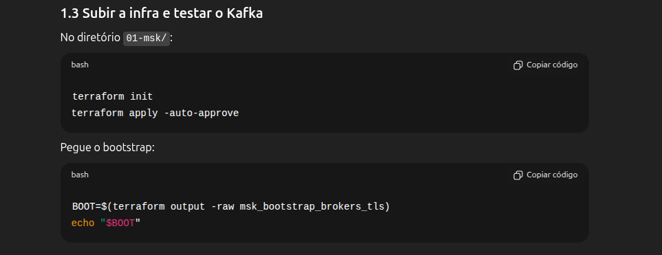
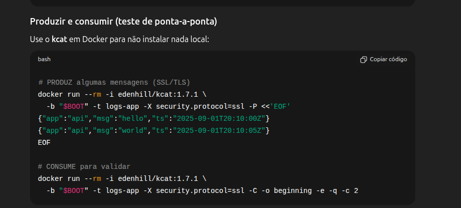

# AWS CLI  Para testar producer/consumer no KAFKA

> `aws configure --profile poc-mks` -> Comando para configurar um profile com Access Keys 

> `aws sts get-caller-identity --profile poc-mks` -> Comando para exibir como está configurado a identidade do profile `poc-mks`

> `aws ssm start-session --target {INSTANCE_ID} --region us-east-1 --profile poc-mks` -> Comando para inicilizar uma sessão na minha instância EC2 via CMD


# Subir a infra e testar o Kafka

No diretório 01-msk/:

terraform init
terraform apply -auto-approve


Pegue o bootstrap:

```bash
BOOT=$(terraform output -raw msk_bootstrap_brokers_tls)
echo "$BOOT" 
```

Produzir e consumir (teste de ponta-a-ponta)

Use o kcat em Docker para não instalar nada local:

# PRODUZ algumas mensagens (SSL/TLS)
```bash
docker run --rm -i edenhill/kcat:1.7.1 \
  -b "$BOOT" -t logs-app -X security.protocol=ssl -P <<'EOF'
{"app":"api","msg":"hello","ts":"2025-09-01T20:10:00Z"}
{"app":"api","msg":"world","ts":"2025-09-01T20:10:05Z"}
EOF
```

# CONSUME para validar
```bash
docker run --rm -i edenhill/kcat:1.7.1 \
  -b "$BOOT" -t logs-app -X security.protocol=ssl -C -o beginning -e -q -c 2
```

# Criar tópico 

```bash
cat >/tmp/client.properties <<'CONF'
security.protocol=SSL
ssl.endpoint.identification.algorithm=https
CONF
```

```bash
# tenta RF=3 (Crie um arquivo de config do cliente (SSL):)
docker run --rm --network host \
  -v /tmp/client.properties:/tmp/client.properties \
  bitnami/kafka:3.6 \
  kafka-topics.sh \
    --bootstrap-server "$BOOT" \
    --command-config /tmp/client.properties \
    --create --topic logs-app --partitions 1 --replication-factor 3

# se aparecer erro de replication factor, use 2 (Crie o tópico (logs-app). Tente com fator 3 (se falhar, use 2):)
docker run --rm --network host \
  -v /tmp/client.properties:/tmp/client.properties \
  bitnami/kafka:3.6 \
  kafka-topics.sh \
    --bootstrap-server "$BOOT" \
    --command-config /tmp/client.properties \
    --create --topic logs-app --partitions 1 --replication-factor 2

```

```bash
# (Opcional) Liste/descrva pra conferir:
docker run --rm --network host -v /tmp/client.properties:/tmp/client.properties \
  bitnami/kafka:3.6 \
  kafka-topics.sh --bootstrap-server "$BOOT" --command-config /tmp/client.properties --list

docker run --rm --network host -v /tmp/client.properties:/tmp/client.properties \
  bitnami/kafka:3.6 \
  kafka-topics.sh --bootstrap-server "$BOOT" --command-config /tmp/client.properties --describe --topic logs-app

```

# Comandos para validater private connection

```bash
VPCE=$(terraform output -json vpce_dns_names | jq -r '.[0]')
ES_USER=$(terraform output -raw ess_username)
ES_PASS=$(terraform output -raw ess_password)
```